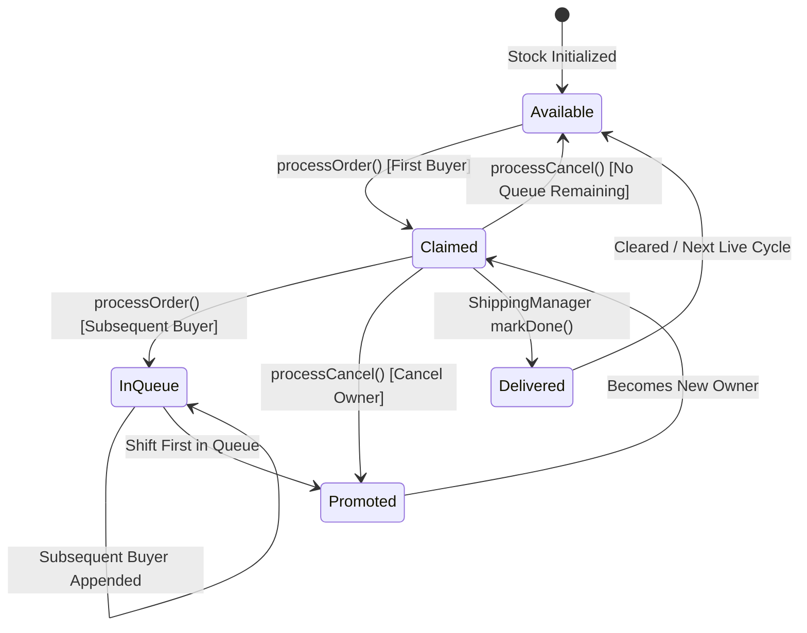

# 🏛️ Manowzab Command Center Architecture & Data Topology

This document details the real-time database schema, lifecycle orchestration, and module relationships for the Manowzab Command Center.

---

## 1. Firebase Realtime Database Topology

```text
root/
├── chats/
│   └── {videoId}/
│       └── {messageId}/
│           ├── id: string
│           ├── author: string
│           ├── displayMessage: string
│           ├── sfxType: "success" | "error" | "cancel" | null
│           ├── phoneticName: string
│           ├── ttsText: string
│           ├── isNew: boolean
│           └── timestamp: number
├── stock/
│   └── {videoId}/
│       ├── size: number (grid size, e.g. 100)
│       └── items/
│           └── {itemNumber}/
│               ├── owner: string | null
│               ├── uid: string | null
│               ├── price: number | null
│               ├── size: string | null
│               ├── queue: Array<{ name: string, uid: string, timestamp: number }>
│               └── bookedAt: number
├── delivery_customers/
│   └── {uid}/
│       ├── name: string
│       ├── recipientName: string | null
│       ├── phone: string | null
│       ├── address: string | null
│       ├── postalCode: string | null
│       ├── deliveryDate: string | null (YYYY-MM-DD)
│       ├── status: "pending" | "done"
│       ├── labelPrinted: boolean
│       ├── labelPrintedAt: number | null
│       ├── totalBookings: number (lifetime count)
│       └── sessions/
│           └── {videoId}/
│               ├── items: number[]
│               └── totalPrice: number
├── history/
│   └── {videoId}/
│       ├── title: string
│       ├── date: string
│       ├── totalSales: number
│       ├── totalItemsSold: number
│       └── orders: object
├── system/
│   ├── hostId: string (active device taking master polling role)
│   ├── activePriceDetectorId: string
│   └── activeTtsKeyIndex: number
├── presence/
│   └── {deviceId}/
│       ├── online: boolean
│       ├── ttsKey: number
│       └── lastSeen: number
└── nicknames/
    └── {originalName}: string (phonetic pronunciation override)
```

---

## 2. Live Order State Machine



---

## 3. High-Throughput Chat Processing Pipeline

1. **Poll / Stream**: YouTube Data API polled via `YouTubeLiveChat.js` using exponential backoff & API key rotation.
2. **Intent Parsing**: `useChatProcessor.js` evaluates regex strategies in order of specificity:
   - Strategy 1: Multi-Buy (`CF 12, 15, 20`)
   - Strategy 2: Pure Number (`24`, `56`)
   - Strategy 3: Explicit CF (`CF 24`, `รับ 24`)
   - Strategy 4: Polite Buying (`24 ค่ะ`, `24 ครับ`)
   - Strategy 5: Dash Syntax (`-24-`)
   - Strategy 6: Customer Name First / Proxy (`พี่อ้อย 24`)
   - Strategy 7: Admin Proxy (`24 พี่อ้อย`)
   - Strategy 8: Cancellation (`ยกเลิก 24`, `ยกเลิก`)
   - Strategy 9: Implicit / Delivery Notice (`ส่ง`, `ส่งเลย`)
3. **Database Dispatch**: Order written using Firebase `runTransaction`.
4. **Firebase Sync Broadcast**: Chat message saved to `chats/{videoId}` with metadata (`sfxType`, `phoneticName`, `ttsText`).
5. **Unified Audio Execution**: Remote clients receive message via `onChildAdded`, check timestamp, and enqueue into `useAudio.js`.
