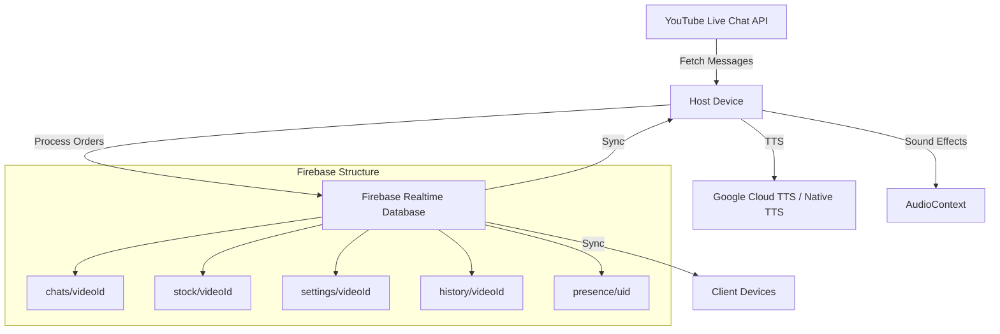

# Product Requirements Document (PRD)

## Manowzab Command Center v4

---

## 1. Product Overview

### 1.1 Product Name

**Manowzab Command Center**

### 1.2 Version

4.9.9

### 1.3 Product Vision

A specialized, high-performance dashboard designed for managing Facebook/YouTube Live commerce that streamlines real-time stock management, automated order processing from chat, and delivers high-quality Text-to-Speech (TTS) announcements for seamless livestream selling operations.

### 1.4 Target Users

- **Primary**: Live commerce sellers and admins managing Facebook/YouTube livestream sales
- **Secondary**: Multi-device teams requiring synchronized inventory and chat management

### 1.5 Product Type

Progressive Web Application (PWA)

---

## 2. Business Requirements

### 2.1 Business Goals

1. Enable real-time stock management during live commerce sessions
2. Automate order processing from chat messages to reduce manual workload
3. Provide instant audio feedback to enhance customer engagement
4. Synchronize data across multiple admin devices for team collaboration
5. Maintain persistent sales history for business analytics

### 2.2 Success Metrics

- Order processing latency < 1 second
- Multi-device sync latency < 100ms
- TTS response time < 3 seconds (Online) or immediate (Offline)
- Zero data loss on page refresh
- Support for 300+ messages per livestream session
- Cost-efficient Firebase usage (minimal read/write operations)

### 2.3 Business Constraints

- Must work reliably on iPad devices (primary usage platform)
- Must support offline TTS fallback for unreliable internet
- Must maintain low operational costs (Firebase quota management)
- Must comply with YouTube API quota limits (polling ≥ 60s intervals)

---

## 3. Technical Requirements

### 3.1 Technology Stack

| Component            | Technology                 | Version  |
| -------------------- | -------------------------- | -------- |
| **Framework**        | Vue 3 (Composition API)    | 3.5.24   |
| **Build Tool**       | Vite                       | 7.2.4    |
| **State Management** | Pinia                      | 3.0.4    |
| **Backend**          | Firebase Realtime Database | 12.7.0   |
| **Authentication**   | Firebase Authentication    | 12.7.0   |
| **Styling**          | Vanilla CSS                | N/A      |
| **PWA**              | VitePWA                    | 1.2.0    |
| **UI Library**       | SweetAlert2                | 11.26.10 |

### 3.2 Architecture



### 3.3 System Architecture Patterns

#### 3.3.1 Host-Client Pattern

- **Host Device**: Fetches YouTube Live Chat, processes orders, writes to Firebase
- **Client Devices**: Read-only observers, synchronized view of stock and chat

#### 3.3.2 Firebase as Single Source of Truth

- All state changes written to Firebase first
- UI updates reactively through Firebase listeners
- Ensures cross-device synchronization and data persistence

#### 3.3.3 Session Isolation by Video ID

- Each livestream has isolated data: `{resource}/{videoId}/...`
- Natural daily session organization
- Prevents data mixing between different streams

---

## 4. Functional Requirements

### 4.1 Live Commerce Management

#### FR-1.1: Real-time Stock Cutting

**Priority**: CRITICAL

**Description**: System must automatically deduct stock when customers type specific patterns in chat.

**Acceptance Criteria**:

- Detect pure numbers (e.g., "26", "38")
- Detect explicit buy commands (e.g., "CF 26", "F 38", "รับ45", "เอา12")
- Detect dash format (e.g., "John-26")
- Process orders within 1 second of message arrival
- Update stock grid with color coding:
  - Green: Available
  - Red: Reserved
  - Grey: Sold out

**Detection Methods**:

1. **Regex - Pure Number**: `^\s*(\d+)\s*$`
2. **Regex - Explicit Buy**: `(?:F|f|cf|CF|รับ|เอา)\s*(\d+)`
3. **Regex - Dash Buy**: `^(?:.+?)\s*[-]\s*(\d+)$`

#### FR-1.2: Multi-Buy Support

**Priority**: HIGH

**Description**: Process multiple item numbers in a single message.

**Acceptance Criteria**:

- Detect patterns like "26 38 74"
- Process each number sequentially
- Provide TTS summary (e.g., "รับไปทั้งหมด 3 ตัว: เบอร์ 26, 38, 74")
- Handle partial success (some numbers unavailable)

#### FR-1.3: Queue System

**Priority**: HIGH

**Description**: Manage multiple customers requesting the same item.

**Acceptance Criteria**:

- First customer becomes owner
- Subsequent customers added to queue
- Display queue count on stock grid
- Auto-promote next customer on cancellation
- Prevent duplicate queue entries (same customer)

#### FR-1.4: Admin Proxy Commands

**Priority**: MEDIUM

**Description**: Admins can manually book items for customers.

**Acceptance Criteria**:

- Admin types customer name in stock grid input
- System assigns item to specified customer
- Mark source as "manual" in Firebase

#### FR-1.5: Cancel Detection

**Priority**: HIGH

**Description**: Automatically detect and process cancellations.

**Acceptance Criteria**:

- Detect "ยก" (cancel) in messages
- Extract item number from cancel message
- Remove owner and promote queue
- Provide TTS feedback (e.g., "ยกเบอร์ 26, ชิงกันใหม่")

---

### 4.2 Advanced Audio & TTS System

#### FR-2.1: Hybrid TTS Engine

**Priority**: CRITICAL

**Description**: Smart switching between Google Cloud TTS and Native Browser TTS.

**Acceptance Criteria**:

- Default to Google Cloud TTS (Neural2, Thai voice)
- Fallback to Native TTS if Google TTS times out (>3s)
- Fallback to Native TTS if API quota exceeded
- Manual toggle between Online/Offline TTS
- Display active TTS mode in header

**Google TTS Specifications**:

- **Voice**: `th-TH-Neural2-C` (Female Thai voice)
- **Encoding**: LINEAR16 (Base64 decoded)
- **Sample Rate**: 24000 Hz
- **API Key Rotation**: Cycle through multiple keys to manage quota

**Native TTS Specifications**:

- **Voice Priority**: Google Thai > Premwadee > Narisa > Pattara > Thai > ไทย
- **Unstuck Logic**: Resume before speak, cancel if stuck
- **Volume**: 1.0 (maximum)

#### FR-2.2: iPad/iOS Audio Unlock

**Priority**: CRITICAL

**Description**: Overcome Safari autoplay restrictions on iOS devices.

**Acceptance Criteria**:

- Unlock AudioContext on first user interaction
- Play silent WAV blob to unlock audio element
- Support both SFX and TTS playback
- No console errors on audio playback

**Implementation**:

- Silent WAV Blob URL (not Base64 Data URI)
- Event listeners: `click`, `touchstart`
- Remove listeners after successful unlock

#### FR-2.3: Sound Effects (SFX)

**Priority**: MEDIUM

**Description**: Provide audio cues for system events.

**Acceptance Criteria**:

- **Success Sound**: Ka-Ching! (on successful order)
- **Error Sound**: Buzzer (on sold out/error)
- Use AudioContext for low-latency playback
- Respect global sound toggle

#### FR-2.4: TTS Queue Management

**Priority**: HIGH

**Description**: Manage text-to-speech queue efficiently.

**Acceptance Criteria**:

- Queue multiple TTS requests
- Process queue sequentially (no overlap)
- Clear queue when sound is toggled off
- Display queue status in UI

---

### 4.3 Intelligent Chat Processing

#### FR-3.1: YouTube Live Integration

**Priority**: CRITICAL

**Description**: Fetch and process YouTube Live Chat messages in real-time.

**Acceptance Criteria**:

- Fetch using YouTube Data API v3
- Polling interval ≥ 60 seconds (quota safety)
- Display viewer count and connection status
- Handle API errors gracefully (display error messages)

**API Endpoints**:

- `youtube.liveStreams.list`: Get `liveChatId`
- `youtube.liveChatMessages.list`: Fetch chat messages

#### FR-3.2: Cross-Device Chat Sync

**Priority**: CRITICAL

**Description**: Synchronize chat messages across all admin devices.

**Acceptance Criteria**:

- Host writes messages to `chats/{videoId}`
- All devices listen to `onChildAdded` events
- Real-time sync latency < 100ms
- Prevent duplicate messages (deduplication via `seenMessageIds`)

#### FR-3.3: Smart Filtering

**Priority**: MEDIUM

**Description**: Filter out spam and irrelevant messages.

**Acceptance Criteria**:

- Ignore messages from non-relevant users (configurable)
- Detect and highlight important messages (buy, cancel, shipping)
- Provide visual indicators for message types

#### FR-3.4: Custom Nickname System

**Priority**: LOW

**Description**: Override display names with custom nicknames.

**Acceptance Criteria**:

- Store nicknames in `nicknames/{uid}`
- Sync across devices via Firebase
- Display custom names in chat and stock grid
- Provide UI to edit nicknames

#### FR-3.5: Chat History & Export

**Priority**: MEDIUM

**Description**: Maintain chat history and allow CSV export.

**Acceptance Criteria**:

- Display up to 200 messages in chat panel
- Store full history in `fullChatLog` for export
- Pagination: "Load More" button for older messages
- Export to CSV with columns: Time, Author, Message, Type, Method

---

### 4.4 System Features

#### FR-4.1: Progressive Web App (PWA)

**Priority**: HIGH

**Description**: Enable installation as standalone app on mobile devices.

**Acceptance Criteria**:

- Manifest with app name, icons, theme colors
- Service worker for offline caching
- Update prompt when new version available
- Cache strategy:
  - NetworkFirst for API calls
  - CacheFirst for fonts and static assets

#### FR-4.2: Pull-to-Refresh

**Priority**: LOW

**Description**: Enable pull-to-refresh gesture on mobile devices.

**Acceptance Criteria**:

- Detect pull gesture on touch devices
- Trigger page reload on pull
- Visual indicator during pull

#### FR-4.3: Away Mode

**Priority**: MEDIUM

**Description**: Display "Away" banner when admin is unavailable.

**Acceptance Criteria**:

- Toggle away mode via header button
- Display timer showing away duration
- Rotate through predefined Thai messages:
  - Start: "แอดมินพาลูกนอนแล้ว รอแปปนะคะ"
  - End: "ลูกหลับแล้ว แอดมินสแตนบายแล้วค่ะ"
- Purple gradient banner at top of screen

#### FR-4.4: History Modal

**Priority**: MEDIUM

**Description**: Display sales history with search and export.

**Acceptance Criteria**:

- Show total sales and item count
- List all previous livestream sessions
- Search/filter by date or Video ID
- Export session data to CSV
- Display session details:
  - Video ID
  - Date
  - Total Sales (THB)
  - Total Items Sold

#### FR-4.5: Live Overlay Mode

**Priority**: LOW

**Description**: OBS overlay for displaying current item on livestream.

**Acceptance Criteria**:

- Display current item number, price, size
- Transparent background for OBS chroma key
- Real-time sync with stock updates
- Large, readable text for stream viewers

#### FR-4.6: Voice Price Page

**Priority**: LOW

**Description**: Interface for voice price detection and announcements.

**Acceptance Criteria**:

- Display detected prices from voice input
- Log voice price history
- Manual price adjustment
- TTS announcement of prices

---

## 5. Non-Functional Requirements

### 5.1 Performance

| Requirement                     | Target      | Measurement                                      |
| ------------------------------- | ----------- | ------------------------------------------------ |
| **Order Processing Latency**    | < 1 second  | Time from message detection to Firebase write    |
| **Multi-Device Sync Latency**   | < 100ms     | Time from Firebase write to UI update on clients |
| **TTS Response Time (Online)**  | < 3 seconds | Time from TTS request to audio playback          |
| **TTS Response Time (Offline)** | Immediate   | Native TTS should start without noticeable delay |
| **Page Load Time**              | < 2 seconds | Initial render on 3G connection                  |
| **Memory Usage**                | < 200 MB    | With 500 messages and 70 stock items             |

### 5.2 Scalability

| Aspect                   | Limit                           | Rationale                |
| ------------------------ | ------------------------------- | ------------------------ |
| **Messages per Session** | 500 displayed, unlimited stored | Memory optimization      |
| **Stock Items**          | 1-200 (default 70)              | Configurable per session |
| **Concurrent Devices**   | Unlimited                       | Firebase handles scaling |
| **Firebase Writes**      | ~300/session                    | Cost optimization        |
| **YouTube API Quota**    | 10,000 units/day                | Free tier limit          |

### 5.3 Reliability

- **Uptime**: 99.9% (dependent on Firebase and YouTube API availability)
- **Data Persistence**: 100% (Firebase Realtime Database)
- **Offline Fallback**: TTS switches to Native mode automatically
- **Error Handling**: Graceful degradation (display errors, retry logic)

### 5.4 Compatibility

| Platform            | Version | Status    |
| ------------------- | ------- | --------- |
| **iPad Safari**     | iOS 14+ | PRIMARY   |
| **Desktop Chrome**  | Latest  | SUPPORTED |
| **Desktop Firefox** | Latest  | SUPPORTED |
| **Desktop Safari**  | Latest  | SUPPORTED |
| **Android Chrome**  | Latest  | SUPPORTED |
| **Mobile Safari**   | iOS 14+ | SUPPORTED |

### 5.5 Security

- **Authentication**: Firebase Authentication (Email/Password)
- **Authorization**: Firebase Realtime Database Rules
  - Admins: Read/Write access to all nodes
  - Observers: Read-only access
- **API Keys**: Stored in environment variables (`.env`)
- **Data Privacy**: No personal data stored beyond chat messages

### 5.6 Maintainability

> [!IMPORTANT]
> **Additive-Only Modification Policy**
>
> All code changes MUST follow these rules:
>
> 1. **Assume existing logic is correct**: Audio, TTS, and Stock sync are optimized
> 2. **Additive changes only**: Write new code alongside old code
> 3. **No deletions**: Unless explicitly instructed to "remove" or "replace"
> 4. **Enhancement over replacement**: New versions must perform better or handle more edge cases
> 5. **Preserve iPad compatibility**: NEVER remove Silent Unlock logic

---

## 6. User Interface Requirements

### 6.1 Layout Structure

```
┌─────────────────────────────────────┐
│           Header                    │
│  [Logo] [Video ID] [TTS] [Settings]│
├─────────────────────────────────────┤
│                                     │
│  ┌──────────┐   ┌───────────────┐  │
│  │          │   │               │  │
│  │  Stock   │   │  Chat Panel   │  │
│  │  Grid    │   │               │  │
│  │          │   │     (200)     │  │
│  │  (70)    │   │               │  │
│  │          │   │ [Load More]   │  │
│  └──────────┘   └───────────────┘  │
│                                     │
└─────────────────────────────────────┘
```

### 6.2 Stock Grid Requirements

**Visual Design**:

- Grid layout with configurable columns (default 7)
- Each cell displays:
  - Item number (large, centered)
  - Owner name (if booked)
  - Queue count (if > 0)
  - Price (optional)

**Color Coding**:

- **Green Gradient**: Available
- **Red Gradient**: Reserved/Booked
- **Grey**: Sold out (after cancellation with no queue)

**Interactions**:

- **Click**: Open detail modal
- **Input Field**: Type customer name for manual booking
- **Keyboard Navigation**: Arrow keys to navigate grid

### 6.3 Chat Panel Requirements

**Visual Design**:

- Scrollable message list (latest at bottom)
- Message bubbles with:
  - Avatar (from YouTube)
  - Display name (or custom nickname)
  - Message text
  - Timestamp
  - Message type icon (buy, cancel, shipping, etc.)

**Color Coding by Type**:

- **Buy**: Green background
- **Cancel**: Red background
- **Shipping**: Blue background
- **Regular**: Grey background

**Interactions**:

- **Auto-scroll**: To bottom on new message
- **Load More**: Button at top to load older messages (50 at a time)
- **Click Message**: Highlight message, show actions (optional)

### 6.4 Header Requirements

**Components**:

1. **Video ID Display**: Current livestream session ID
2. **Connection Status**:
   - Green: Connected to YouTube
   - Red: Disconnected
   - Yellow: Connecting
3. **TTS Toggle Button**:
   - Online (Google TTS): Google icon + API key index badge (e.g., "#1")
   - Offline (Native TTS): Browser icon
   - Color-coded for easy identification
4. **Sound Toggle**: Speaker icon (on/off)
5. **Settings Menu**: Gear icon with dropdown
   - Stock Size
   - Clear Stock
   - Away Mode
   - History
   - Logout

### 6.5 Responsive Design

**Desktop** (≥768px):

- Side-by-side layout (Stock Grid | Chat Panel)
- Full header with all components
- Stock grid: 7 columns

**iPad Portrait** (768px):

- Side-by-side layout (Stock Grid | Chat Panel)
- Full header
- Stock grid: 5-6 columns

**iPad Landscape** (1024px):

- Side-by-side layout with more width
- Full header
- Stock grid: 8-10 columns

**Mobile** (<768px):

- Stacked layout (Stock Grid above Chat Panel)
- Condensed header
- Stock grid: 3-4 columns

### 6.6 Accessibility

- **Safe Area Support**: Respect iOS safe area insets (notch, home indicator)
- **Touch Targets**: Minimum 44x44px for all interactive elements
- **Font Sizes**: Minimum 14px for body text, 16px for inputs
- **Contrast Ratios**: AA compliance (4.5:1 for normal text)

---

## 7. Data Model

### 7.1 Firebase Realtime Database Structure

```
firebase-root/
├── chats/
│   └── {videoId}/
│       └── {pushId}/
│           ├── id: string
│           ├── text: string
│           ├── authorName: string
│           ├── displayName: string
│           ├── realName: string
│           ├── uid: string
│           ├── avatar: string (URL)
│           ├── color: string (hex)
│           ├── isAdmin: boolean
│           ├── type: string (buy|cancel|shipping|regular)
│           ├── detectionMethod: string (regex-pure|regex-explicit|regex-dash|ai|manual)
│           └── timestamp: number
│
├── stock/
│   └── {videoId}/
│       └── {itemNumber}/
│           ├── owner: string
│           ├── uid: string
│           ├── time: number
│           ├── price: number (optional)
│           ├── size: string (optional)
│           ├── source: string (manual|chat|ai|queue)
│           └── queue: Array<{owner, uid, time}>
│
├── settings/
│   └── {videoId}/
│       └── stockSize: number
│
├── history/
│   └── {videoId}/
│       ├── totalSales: number
│       ├── totalItems: number
│       ├── date: string
│       └── lastUpdated: number
│
├── nicknames/
│   └── {uid}/
│       ├── nickname: string
│       └── updatedAt: number
│
├── overlay/
│   └── {videoId}/
│       └── current_item/
│           ├── id: number
│           ├── price: number
│           ├── size: string
│           └── updatedAt: number
│
├── presence/
│   └── {uid}/
│       ├── online: boolean
│       ├── lastSeen: number
│       └── deviceInfo: string
│
└── system/
    ├── activeVideo: string (videoId)
    └── isHost: {uid}: boolean
```

### 7.2 Local State (Pinia Stores)

#### Chat Store

```typescript
{
  messages: Array<Message>,          // Displayed messages (max 200)
  fullChatLog: Array<Message>,       // Full log for export
  streamStartTime: number,           // Session start timestamp
  seenMessageIds: Set<string>        // Deduplication
}
```

#### Stock Store

```typescript
{
  stockData: Record<number, StockItem>,  // Item number → Stock data
  stockSize: number                      // Max items (default 70)
}
```

#### System Store

```typescript
{
  currentVideoId: string,            // Active session Video ID
  isConnected: boolean,              // YouTube connection status
  isSoundOn: boolean,                // Global sound toggle
  useOnlineTts: boolean,             // TTS mode toggle
  isAwayMode: boolean,               // Away mode active
  awayStartTime: number,             // Away mode start time
  isHost: boolean,                   // Host device flag
  statusApi: string,                 // API status (idle|connecting|connected|error)
  statusChat: string                 // Chat status (idle|connecting|connected|error)
}
```

#### Nickname Store

```typescript
{
  nicknames: Record<string, string>; // uid → custom name
}
```

---

## 8. Integration Requirements

### 8.1 YouTube Data API v3

**Endpoints Used**:

1. **liveStreams.list**
   - Get `liveChatId` from Video ID
   - Parameters: `part=snippet`, `id={videoId}`
2. **liveChatMessages.list**
   - Fetch chat messages
   - Parameters: `part=snippet,authorDetails`, `liveChatId={liveChatId}`, `pageToken={nextPageToken}`

**Quota Management**:

- Each `liveChatMessages.list` call costs 5 units
- Daily quota: 10,000 units (free tier)
- Max calls per day: 2,000
- Polling interval: 60 seconds minimum
- Max livestream duration: ~33 hours per day

### 8.2 Google Cloud Text-to-Speech API

**Endpoint**: `https://texttospeech.googleapis.com/v1/text:synthesize`

**Request Format**:

```json
{
  "input": { "text": "สวัสดีค่ะ" },
  "voice": {
    "languageCode": "th-TH",
    "name": "th-TH-Neural2-C"
  },
  "audioConfig": {
    "audioEncoding": "LINEAR16",
    "sampleRateHertz": 24000
  }
}
```

**Response**:

```json
{
  "audioContent": "Base64EncodedAudioData"
}
```

**API Key Management**:

- Rotate through multiple API keys
- Display active key index in header (e.g., "#1", "#2")
- Automatic fallback on quota exceeded (429 error)

### 8.3 Firebase Realtime Database

**Configuration**:

- Region: `asia-southeast1` (Singapore) for low latency
- Rules: Authenticated read/write for admins
- Indexing: Add indexes for query performance

**Security Rules Example**:

```json
{
  "rules": {
    "chats": {
      "$videoId": {
        ".read": "auth != null",
        ".write": "auth != null"
      }
    },
    "stock": {
      "$videoId": {
        ".read": "auth != null",
        ".write": "auth != null"
      }
    }
  }
}
```

### 8.4 Optional Integrations

#### Gemini AI (Optional)

- **Purpose**: Voice price detection
- **API**: Google AI Studio
- **Status**: Optional feature, can be disabled

#### Ollama (Optional)

- **Purpose**: Local AI for chat analysis
- **Requirements**: Ollama installed on local machine
- **Port**: 11434 (default)
- **Status**: Optional feature, gracefully degrades if unavailable

---

## 9. Deployment & Operations

### 9.1 Development Workflow

```bash
# Install dependencies
npm install

# Start development server
npm run dev

# Build for production
npm run build

# Build for GitHub Pages
npm run build:gh

# Deploy to GitHub Pages
npm run deploy
```

### 9.2 Environment Variables

Create `.env` file in project root:

```env
# YouTube Data API Key
VITE_YOUTUBE_API_KEY=your_youtube_api_key

# Google Cloud TTS API Keys (multiple for rotation)
VITE_GOOGLE_TTS_API_KEY_1=your_google_tts_key_1
VITE_GOOGLE_TTS_API_KEY_2=your_google_tts_key_2
VITE_GOOGLE_TTS_API_KEY_3=your_google_tts_key_3

# Firebase Configuration
VITE_FIREBASE_API_KEY=your_firebase_api_key
VITE_FIREBASE_AUTH_DOMAIN=your_project.firebaseapp.com
VITE_FIREBASE_DATABASE_URL=https://your_project.firebaseio.com
VITE_FIREBASE_PROJECT_ID=your_project_id
VITE_FIREBASE_STORAGE_BUCKET=your_project.appspot.com
VITE_FIREBASE_MESSAGING_SENDER_ID=your_sender_id
VITE_FIREBASE_APP_ID=your_app_id

# Optional: Gemini AI
VITE_GEMINI_API_KEY=your_gemini_key
```

### 9.3 Deployment Process

**Platform**: GitHub Pages

**Steps**:

1. Build with `npm run build:gh` (sets base path to `/manowzab-v4/`)
2. Deploy with `npm run deploy` (uses `gh-pages` package)
3. Wait for GitHub Pages to update (~1 minute)
4. Access at: `https://{username}.github.io/manowzab-v4/`

### 9.4 Monitoring & Logging

**Console Logging**:

- Debug mode enabled via `DEBUG_MODE = true` in `useChatProcessor.js`
- Log levels: `logger.log()`, `logger.warn()`, `logger.error()`
- Key events logged:
  - Firebase connection status
  - YouTube API responses
  - Chat message processing
  - Stock transactions
  - TTS queue changes

**Error Tracking**:

- Firebase errors caught and displayed to user (SweetAlert2 toasts)
- YouTube API errors displayed in connection status
- TTS errors fallback to Native TTS with console warnings

---

## 10. Testing Requirements

### 10.1 Unit Testing (Not Implemented)

Future consideration: Add Vitest for unit tests

### 10.2 Manual Testing Scenarios

#### Scenario 1: Order Processing

1. Start livestream on YouTube
2. Open app as Host device
3. Type "26" in YouTube chat
4. **Expected**: Stock grid shows item 26 as red (reserved)
5. **Expected**: TTS announces "รับเบอร์ 26"
6. **Expected**: Success sound plays

#### Scenario 2: Multi-Device Sync

1. Open app on Device A (tablets)
2. Open app on Device B (phone)
3. Process order on Device A
4. **Expected**: Device B updates within 100ms
5. **Expected**: Both devices show identical stock grid

#### Scenario 3: TTS Fallback

1. Disconnect internet or exhaust Google TTS quota
2. Process order
3. **Expected**: System automatically switches to Native TTS
4. **Expected**: Header shows "Offline" TTS mode
5. **Expected**: TTS continues to work with native voice

#### Scenario 4: iPad Audio Unlock

1. Open app on iPad Safari
2. Do NOT interact with page
3. Process order (via Firebase from another device)
4. **Expected**: No audio plays (iOS restriction)
5. Tap anywhere on screen
6. **Expected**: Subsequent orders play audio successfully

#### Scenario 5: Page Refresh Persistence

1. Process 10 orders
2. Refresh page (F5)
3. **Expected**: All 10 orders reappear in stock grid
4. **Expected**: Chat messages reload
5. **Expected**: No data loss

### 10.3 Performance Testing

**Load Testing**:

- Process 100 orders in rapid succession
- **Expected**: All orders processed within 5 seconds total
- **Expected**: No UI lag or memory leaks

**Stress Testing**:

- Run for 3-hour livestream session
- Process 300+ messages
- **Expected**: Memory usage < 200 MB
- **Expected**: No performance degradation

---

## 11. Risks & Mitigation

| Risk                             | Impact | Probability | Mitigation                                                           |
| -------------------------------- | ------ | ----------- | -------------------------------------------------------------------- |
| **YouTube API Quota Exceeded**   | HIGH   | MEDIUM      | Polling interval ≥ 60s, monitor quota usage, fallback to manual mode |
| **Google TTS Quota Exceeded**    | MEDIUM | MEDIUM      | Multiple API keys with rotation, Native TTS fallback                 |
| **Firebase Cost Overrun**        | MEDIUM | LOW         | Optimize writes, use transactions, monitor usage                     |
| **iOS Audio Restrictions**       | HIGH   | LOW         | Silent Unlock implemented, tested on iPads                           |
| **Internet Connection Loss**     | MEDIUM | MEDIUM      | Offline TTS fallback, Firebase auto-reconnect                        |
| **Browser Compatibility Issues** | LOW    | LOW         | Test on all major browsers, use standard web APIs                    |

---

## 12. Future Enhancements (Out of Scope)

1. **Auto-Delete Old Chats**
   - Remove chats older than 7 days from Firebase
   - Reduce storage costs

2. **Chat Search/Filter**
   - Search by author name
   - Filter by type (buy/cancel/shipping)
   - Filter by detection method

3. **Export Historical Chats**
   - Download chat logs from Firebase (not just current session)
   - Export all sessions to CSV

4. **Read-Only Observer Role**
   - Dedicated role for view-only access
   - No write permissions
   - Lower Firebase costs

5. **Multi-Language Support**
   - Add English language option
   - Localize all Thai strings

6. **Mobile App (React Native)**
   - Convert to native mobile app
   - Better performance on mobile devices

7. **Analytics Dashboard**
   - Sales trends over time
   - Popular item numbers
   - Customer statistics

8. **Shipping Address Collection**
   - Modal to collect customer address
   - Store in Firebase
   - Export with order data

---

## 13. Glossary

| Term              | Definition                                                          |
| ----------------- | ------------------------------------------------------------------- |
| **CF**            | Confirm - Common command used by customers to confirm purchase      |
| **Video ID**      | YouTube Video ID (11 characters) identifying a livestream session   |
| **Host Device**   | Primary admin device that fetches YouTube chat and processes orders |
| **Client Device** | Secondary observer devices with read-only synchronized view         |
| **TTS**           | Text-to-Speech - System for converting text to spoken audio         |
| **SFX**           | Sound Effects - Audio cues for success/error events                 |
| **Stock Grid**    | Visual grid displaying all available/reserved/sold items            |
| **Queue**         | List of customers waiting for an occupied item number               |
| **Session**       | Single livestream instance, isolated by Video ID                    |
| **Pure Number**   | Message containing only a number (e.g., "26")                       |
| **Explicit Buy**  | Message with explicit buy command (e.g., "CF 26", "รับ45")          |
| **Dash Buy**      | Message in format "Name-Number" (e.g., "John-26")                   |
| **Multi-Buy**     | Single message containing multiple item numbers                     |

---

## 14. Approval & Sign-off

| Role              | Name | Date | Signature |
| ----------------- | ---- | ---- | --------- |
| **Product Owner** |      |      |           |
| **Tech Lead**     |      |      |           |
| **QA Lead**       |      |      |           |

---

## 15. Document History

| Version | Date       | Author       | Changes                                    |
| ------- | ---------- | ------------ | ------------------------------------------ |
| 1.0     | 2026-02-09 | AI Assistant | Initial PRD created from codebase analysis |

---

## 16. References

- [Vue 3 Documentation](https://vuejs.org/)
- [Firebase Realtime Database Documentation](https://firebase.google.com/docs/database)
- [YouTube Data API v3](https://developers.google.com/youtube/v3/docs)
- [Google Cloud Text-to-Speech API](https://cloud.google.com/text-to-speech/docs)
- [Web Speech API](https://developer.mozilla.org/en-US/docs/Web/API/Web_Speech_API)

---

**END OF DOCUMENT**
